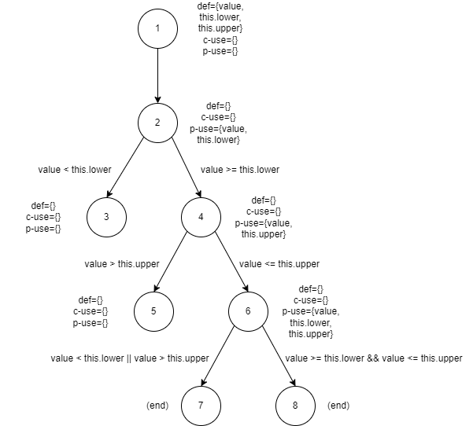

**SENG 438 - Software Testing, Reliability, and Quality**

**Lab. Report #3 – Code Coverage, Adequacy Criteria and Test Case Correlation**

| Group \#:      |  14   |
| -------------- | --- |
| Student Names: |   Mary  |
|                |   Nicola  |
|                |   Tyler  |
|                |   Jaxon  |

# 1 Introduction

In this lab, we will be running coverage tests on the test suite developed in the previous lab. First, we will collect various coverage data such as line, branch, and method coverage. Eclipse and EclEmma will be used to collect the coverage information. Using this coverage information, we will use white box testing techniques to go back and refine the test suite in order to meet the minimum coverage requirements. To remain consistent with the previous lab, we will again be using JUnit 4 to write and run our software tests. 

# 2 Control-flow Coverage

To measure the control flow coverage we are using EclEmma. To calculate statement coverage we used EclEmma’s line counter. We used the branch counter to calculate branch coverage. Unfortunately, EclEmma does not support condition coverage, we attempted to use CodeCover but it did not work in the version of eclipse installed. We decided to use EclEmma’s method coverage as a third coverage metric.

## 2.1 Range

The coverage for the Range class is as follows:

| Class/Function        | Statement Coverage  | Branch Coverage | Method Coverage |
|-----------------------|---------------------|-----------------|-----------------|
| **Range**             | **20.2%%**          | **13.4%**       | **34.8%**       |
| getCentralValue()     | 100%                | 100%            | 100%            |
| getLength()           | 40%                 | 50%             | 100%            |
| toString()            | 100%                | 100%            | 100%            |
| contains()            | 100%                | 75%             | 100%            |
| exapnd()              | 75%                 | 50%             | 100%            |

## 2.2 DataUtilities

The coverage for the DataUtilities class is as follows:

| Class/Function                      | Statement Coverage  | Branch Coverage | Method Coverage |
|-------------------------------------|---------------------|-----------------|-----------------|
| **DataUtilities**                   | **45.8%**           | **35.9%**       | **50%**         |
| CalculateColumnTotal(Values2D, int) | 75%                 | 62.5%           | 100%            |
| CalculateRowTotal(Values2D, int)    | 75%                 | 62.5%           | 100%            |
| getCumulativePercentage(KeyedValues)| 83.3%               | 75%             | 100%            |
| createNumberArray(double[])         | 100%                | 100%            | 100%            |
| createNumberArray2D(double[][])     | 100%                | 100%            | 100%            |

# 3 Manual data-flow coverage calculations for X and Y methods

## 3.1 Contains - method from Range

### 3.1.1 Def-use Sets
First we will outline the Def-use sets for each statement of Contains

| Line \#:     |  Code   | Def-use sets |
| ------------ | ------- | --- |
| 1            |   public boolean contains(double value) {                    | Def(1) = {value, this.lower, this.upper} |
| 2            |   if (value < this.lower) {                                  | Use(2) = {value, this.lower}   |
| 3            |   return false;                                              | - |
| 4            |   }  							      | - |
| 5            |   if (value  > this.upper) { 				      | Use(5) = {value, this.upper}  |
| 6            |   return false; 					      | - |
| 7            |   }                                                          | - |
| 8            |   return (value >= this.lower && value <= this.upper);       | Use(8) = {value, this.lower, this.upper} |
| 9            |   }                                                          | - |

#### 3.1.2 Data-flow Graph
Using the def-use sets we will create the data flow graph so we can analyse the data-flow coverage.

#### 3.1.3 DU pairs

Using the data-flow graph we can summarize the def-use pairs for each node.

| Variable (v)  | Defined in node (n) | dcu(v, n)     | dpu(v, n)                         |
|---------------|---------------------|---------------|-----------------------------------|
| value         | 1                   | {}            | {(3, 4), (5, 6), (7, 8)}         |
| this.lower    | 1                   | {}            | {(3, 4), (7, 8)}                  |
| this.upper    | 1                   | {}            | {(5, 6), (7, 8)}                |

#### 3.1.4 Data-flow Coverage
Now, we will calculate $CU$ and $PU$:
	
  $$CU = 0$$
	
  $$PU = 7$$
  
Next, we will check for any infeasible test cases. If the predicate path (3, 4) or (5, 6) are followed then the predicate path (7, 8) cannot be followed. Hence the following DU pairs are not feasible:

| Variable (v)  | Defined in node (n) | dcu(v, n)     | dpu(v, n)                         |
|---------------|---------------------|---------------|-----------------------------------|
| value         | 1                   | {}           | {(7,8)}                                |
| this.lower    | 1                   | {}           | {(7,8)}                                |
| this.upper    | 1                   | {}           | {(7,8)}                                |

From these we can calculate $CU_f$ and $PU_f$:
  
  $$CU_f=0$$
  
  $$PU_f=3$$

Using our test cases we developed in assignment 2 we can check the DU-Pairs we are covering:

| Test Case # | data            | column  | dcu(v, n)                                                                                                             | dpu(v, n)                                                                                       |
|-------------|-----------------|---------|-----------------------------------------------------------------------------------------------------------------------|-------------------------------------------------------------------------------------------------|
| 1           | [ [1.0, 1.0] ]  | 0       | data = {(1, 1), (2, 1), 4, 1}, column = {(4, 1)}, total= {(5, 1), (5, 5), (5, 9)}, r = {(3, 3), (4, 3)}, n = {(5, 4)} | rowCount = {(3, 4), (3, 6), (6, 9)}, r = {(3, 4), (3, 6)}, n = ({4, 5}), r2 = {(6, 9)}          |

### 3.2 CalculateColumnTotal

#### 3.2.1 Def-use Sets
First we will outline the Def-use sets for each statement of CalculateColumnTotal

| Line \#:  | Code                                            | Def-use sets                            |
|-----------|-------------------------------------------------|-----------------------------------------|
| 1         | calculateColumnTotal(Values2D data, int column) | def(1)={data,column}, use(1) = {}       |
| 2         | ParamChecks.nullNotPermitted(data, "data");     | def(2)={}, use(2)={data}                |
| 3         | double total = 0.0;                             | def(3)={total}, use(3)={}               |
| 4         | int rowCount = data.getRowCount();              | def(4)={rowCount}, use(4)={data}        |
| 5         | for (int r = 0; r < rowCount; r++) {            | def(5)={r}, use(5)={rowCount, r}        |
| 6         | Number n = data.getValue(r, column);            | def(6)={n}, use(6)={data,r,column}      |
| 7         | if (n != null) {                                | def(7)={}, use(7)={n}                   |
| 8         | total += n.doubleValue();                       | def(8)={total}, use(8)={n}              |
| 9         | }                                               | def(9)={}, use(9)={}                    |
| 10        | }                                               | def(10)={}, use(10)={}                  |
| 11        | for (int r2 = 0; r2 > rowCount; r2++) {         | def(11)={r2}, use(11)={rowCount, r2}    |
| 12        | Number n = data.getValue(r2, column);           | def(12)={n}, use(12)={data,r2, column}  |
| 13        | if (n != null) {                                | def(13)={}, use(13)={n}                 |
| 14        | total += n.doubleValue();                       | def(14)={total}, use(14)={n}            |
| 15        | }                                               | def(15)={}, use(15)={}                  |
| 16        | }                                               | def(16)={}, use(16)={}                  |
| 17        | return total;                                   | def(17)={}, use(17)={total}             |

#### 3.2.2 Data-flow Graph
Using the def-use sets we will create the data flow graph so we can analyse the data-flow coverage.

#### 3.2.3 DU pairs

Using the data-flow graph we can summarize the def-use pairs for each node.

| Variable (v)  | Defined in node (n) | dcu(v, n)     | dpu(v, n)                         |
|---------------|---------------------|---------------|-----------------------------------|
| data          | 1                   | {1, 2, 4, 7}  | {}                                |
| column        | 1                   | {4, 7}        | {}                                |
| total         | 1                   | {5, 8, 9}     | {}                                |
| total         | 5                   | {5, 8, 9}     | {}                                |
| total         | 8                   | {8, 9}        | {}                                |
| rowCount      | 2                   | {}            | {(3, 4), (3, 6), (6, 7), (6, 9)}  |
| r             | 3                   | {3, 4}        | {(3, 4), (3, 6)}                  |
| n             | 4                   | {5}           | {(4, 5), (4, 3)}                  |
| r2            | 6                   | {6, 7}        | {(6, 7), (6, 9)}                  |
| n             | 7                   | {8}           | {(7, 8), (7, 6)}                  |

#### 3.2.4 Data-flow Coverage
First we will calculate $CU$ and $PU$:
	
  $$CU = 20$$
	
  $$PU = 12$$
  
Next, we will check for any infeasible test cases. If the predicate path (3, 4) from the variable rowCount defined at node 2 is followed then the predicate path (6, 7) cannot be followed. Hence the following DU pairs are not feasible:

| Variable (v)  | Defined in node (n) | dcu(v, n)     | dpu(v, n)                         |
|---------------|---------------------|---------------|-----------------------------------|
| data          | 1                   | {7}           | {}                                |
| column        | 1                   | {7}           | {}                                |
| total         | 1                   | {8}           | {}                                |
| total         | 5                   | {8}           | {}                                |
| total         | 8                   | {8, 9}        |                                   |
| rowCount      | 2                   | {}            | {(6, 7)}                          |
| r2            | 6                   | {6, 7}        | {(6, 7)}                          |
| n             | 7                   | {8}           | {(7, 8), (7, 9)}                  |
 
From these we can calculate $CU_f$ and $PU_f$:
  
  $$CU_f=9$$
  
  $$PU_f= 4$$
  
Using our test cases we developed in assignment 2 we can check the DU-Pairs we are covering:

| Test Case # | data            | column  | dcu(v, n)                                                                                                             | dpu(v, n)                                                                                       |
|-------------|-----------------|---------|-----------------------------------------------------------------------------------------------------------------------|-------------------------------------------------------------------------------------------------|
| 1           | [ [1.0, 1.0] ]  | 0       | data = {(1, 1), (2, 1), 4, 1}, column = {(4, 1)}, total= {(5, 1), (5, 5), (5, 9)}, r = {(3, 3), (4, 3)}, n = {(5, 4)} | rowCount = {(3, 4), (3, 6), (6, 9)}, r = {(3, 4), (3, 6)}, n = ({4, 5}), r2 = {(6, 9)}          |
| 2           | [ [1.0, -1.0] ] | 0       | data = {(1, 1), (2, 1), 4, 1}, column = {(4, 1)}, total= {(5, 1), (5, 5), (5, 9)}, r = {(3, 3), (4, 3)}, n = {(5, 4)} | rowCount = {(3, 4), (3, 6), (6, 9)}, r = {(3, 4), (3, 6)}, n = ({4, 5}), r2 = {(6, 9)}          |
| 3           | [ [-1.0, 1.0] ] | 0       | data = {(1, 1), (2, 1), 4, 1}, column = {(4, 1)}, total= {(5, 1), (5, 5), (5, 9)}, r = {(3, 3), (4, 3)}, n = {(5, 4)} | rowCount = {(3, 4), (3, 6), (6, 9)}, r = {(3, 4), (3, 6)}, n = ({4, 5}), r2 = {(6, 9)}          |
| 4           | [ [-1.0, -1.0] ]| 0       | data = {(1, 1), (2, 1), 4, 1}, column = {(4, 1)}, total= {(5, 1), (5, 5), (5, 9)}, r = {(3, 3), (4, 3)}, n = {(5, 4)} | rowCount = {(3, 4), (3, 6), (6, 9)}, r = {(3, 4), (3, 6)}, n = ({4, 5}), r2 = {(6, 9)}          |
| 5           | [ [-1.0, 0.0] ] | 0       | data = {(1, 1), (2, 1), 4, 1}, column = {(4, 1)}, total= {(5, 1), (5, 5), (5, 9)}, r = {(3, 3), (4, 3)}, n = {(5, 4)} | rowCount = {(3, 4), (3, 6), (6, 9)}, r = {(3, 4), (3, 6)}, n = ({4, 5}), r2 = {(6, 9)}          |
| 6           | [ [0.0, 1.0] ]  | 0       | data = {(1, 1), (2, 1), 4, 1}, column = {(4, 1)}, total= {(5, 1), (5, 5), (5, 9)}, r = {(3, 3), (4, 3)}, n = {(5, 4)} | rowCount = {(3, 4), (3, 6), (6, 9)}, r = {(3, 4), (3, 6)}, n = ({4, 5}), r2 = {(6, 9)}          |
| 7           | [ [0.0, -1.0] ] | 0       | data = {(1, 1), (2, 1), 4, 1}, column = {(4, 1)}, total= {(5, 1), (5, 5), (5, 9)}, r = {(3, 3), (4, 3)}, n = {(5, 4)} | rowCount = {(3, 4), (3, 6), (6, 9)}, r = {(3, 4), (3, 6)}, n = ({4, 5}), r2 = {(6, 9)}          |
| 8           | [ [0.0, 0.0] ]  | 0       | data = {(1, 1), (2, 1), 4, 1}, column = {(4, 1)}, total= {(5, 1), (5, 5), (5, 9)}, r = {(3, 3), (4, 3)}, n = {(5, 4)} | rowCount = {(3, 4), (3, 6), (6, 9)}, r = {(3, 4), (3, 6)}, n = ({4, 5}), r2 = {(6, 9)}          |
| 9           | [ [null, 1.0] ] | 0       | data = {(1, 1), (2, 1), 4, 1}, column = {(4, 1)}, total= {(5, 1), (5, 5), (5, 9)}, r = {(3, 3), (4, 3)}, n = {(5, 4)} | rowCount = {(3, 4), (3, 6), (6, 9)}, r = {(3, 4), (3, 6)}, n = ({4, 5}, {4, 3}), r2 = {(6, 9)}  |
| 10          | [ [null, -1.0] ]| 0       | data = {(1, 1), (2, 1), 4, 1}, column = {(4, 1)}, total= {(5, 1), (5, 5), (5, 9)}, r = {(3, 3), (4, 3)}, n = {(5, 4)} | rowCount = {(3, 4), (3, 6), (6, 9)}, r = {(3, 4), (3, 6)}, n = ({4, 5}, {4, 3}), r2 = {(6, 9)}  |
| 11          | [ [null, 0.0] ] | 0       | data = {(1, 1), (2, 1), 4, 1}, column = {(4, 1)}, total= {(5, 1), (5, 5), (5, 9)}, r = {(3, 3), (4, 3)}, n = {(5, 4)} | rowCount = {(3, 4), (3, 6), (6, 9)}, r = {(3, 4), (3, 6)}, n = ({4, 5}, {4, 3}), r2 = {(6, 9)}  |
| 12          | [ [1.0, null] ] | 0       | data = {(1, 1), (2, 1), 4, 1}, column = {(4, 1)}, total= {(5, 1), (5, 5), (5, 9)}, r = {(3, 3), (4, 3)}, n = {(5, 4)} | rowCount = {(3, 4), (3, 6), (6, 9)}, r = {(3, 4), (3, 6)}, n = ({4, 5}, {4, 3}), r2 = {(6, 9)}  |
| 13          | [ [-1.0, null] ]| 0       | data = {(1, 1), (2, 1), 4, 1}, column = {(4, 1)}, total= {(5, 1), (5, 5), (5, 9)}, r = {(3, 3), (4, 3)}, n = {(5, 4)} | rowCount = {(3, 4), (3, 6), (6, 9)}, r = {(3, 4), (3, 6)}, n = ({4, 5}, {4, 3}), r2 = {(6, 9)}  |
| 14          | [ [0.0, null] ] | 0       | data = {(1, 1), (2, 1), 4, 1}, column = {(4, 1)}, total= {(5, 1), (5, 5), (5, 9)}, r = {(3, 3), (4, 3)}, n = {(5, 4)} | rowCount = {(3, 4), (3, 6), (6, 9)}, r = {(3, 4), (3, 6)}, n = ({4, 5}, {4, 3}), r2 = {(6, 9)}  |
| 15          | null            | 0       | data = {(1, 1)}                                                                                                       | N/A                                                                                             |

From these test cases we can calculate $CU_c$ and $PU_C$:

  $$CU_c = 10$$
  
  $$PU_C = 8$$
  
Now we can calculate the data flow coverage:

  $$ au = {CU_c + PU_c \over (CU + PU) - (CU_f + PU_f)} * 100 = 94.7\\% $$

# 4 A detailed description of the testing strategy for the new unit test

While we had achieved the minimum required coverage for the majority of methods, there were a few cases where we identified room for improvement.
To address this, we decided to use both structural and data flow coverage criteria. 
We specifically focused on areas where we could improve conditional coverage and, using our manual data flow coverage calculations, 
we designed additional tests to enhance this metric.

# 5 A high level description of five selected test cases you have designed using coverage information, and how they have increased code coverage

For calculateColumnTotal and CalculateRowTotal, we add a test case in each that improves the conditional coverage of each function. Using the data-flow graph
in the prior function we created a test case that passes in a zero-length data variable. This improves the data-flow coverage to 100% for each function by covering the total: {1, 9} du-pair.

# 6 A detailed report of the coverage achieved of each class and method (a screen shot from the code cover results in green and red color would suffice)

## 6.1 Data Utilities

### 6.1.1 CalculateColumnTotal and CalculateRowTotal

Since there is unreachable code, it was not possible to meet the minimum test coverage. 
Specifically, the second for loop in each function is impossible to reach. 

We were able to improve the conditional coverage by creating a unit test for each function that utilized a zero-length data variable.

### 6.1.2 GetCumulativePercentages

As with the prior tests it was not possible to reach the minimum test coverage due to the existence of unreachable code. However, we were able to reach minimum branch coverage.

### 6.1.3 GetNumberArray

We were able to reach 100% statement, branch, and condition coverage for both CreateNumberArray functions. We did not have to add any tests as our prior tests reached the minimum coverage for each metric.

### 6.1.4 Coverage Report

Statement Coverage:

Branch Coverage:

# 7 Pros and Cons of coverage tools used and Metrics you report

In this lab, we used EclEmma to measure our code coverage. EclEmma is a simple and effective tool that integrates seamlessly with Eclipse, allowing us to calculate statement and branch coverage for our unit tests. However, it did not provide insight into conditional coverage. To remedy this we attempted to use CodeCover, however, we were unable to get it to function properly with our version of Eclipse.

Statement coverage was not as useful because most methods had already achieved the maximum line coverage, branch coverage was more informative because it allowed us to evaluate whether we were covering all possible branches in the program. However, the most valuable metric was data-flow coverage, which enabled us to assess our coverage of the relevant function and eliminate any infeasible DU pairs. This provided the most accurate measure of our unit test coverage.

# 8 A comparison on the advantages and disadvantages of requirements-based test generation and coverage-based test generation.

We found that requirements-based testing offered more benefits than coverage-based testing, as it compelled us to focus on the method's requirements when designing our unit tests instead of solely aiming for high coverage. However, we discovered that requirements-based testing alone may not capture all relevant test cases, as we only considered cases that fulfilled the specified requirements. Through the use of data-flow analysis and conditional coverage metrics, we were able to identify and address these overlooked test cases. This led us to the conclusion that a combination of requirements- and coverage-based test generation is the most effective approach.

# 9 A discussion on how the team work/effort was divided and managed

Once it was clear which tests needed to be modified and added to increase coverage, each group member was assigned 2-3 methods to write and/or modify in order to meet the minimum required coverage. All group members contributed to the writing of the lab report. 

# 10 Any difficulties encountered, challenges overcome, and lessons learned from performing the lab

The main difficulty encountered in the lab was figuring out how all the different coverage tools worked with various IDE’s and choosing the best tools to carry out the lab with. A lesson learned is that the simplest tool is often the best one to use for a given problem. 

# 11 Comments/feedback on the lab itself

The lab document was once again clear and easy to understand the tasks we needed to complete for this lab, but having a pdf version of it along with the markdown version would be helpful. 
